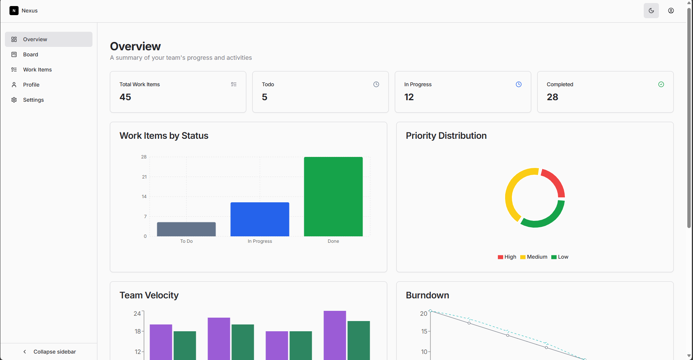

# Dashboard Analytics - Frontend

A modern React frontend application for data analytics and visualization, featuring a responsive dashboard interface.



## 🚀 Technologies

- [React](https://react.dev/) - A JavaScript library for building user interfaces
- [Next.js](https://nextjs.org/) - The React Framework for Production
- [TypeScript](https://www.typescriptlang.org/) - JavaScript with syntax for types
- [Tailwind CSS](https://tailwindcss.com/) - A utility-first CSS framework
- [React Query](https://tanstack.com/query/latest) - Powerful asynchronous state management
- [Axios](https://axios-http.com/) - Promise based HTTP client

## 🎨 Features

- Responsive Dashboard Layout
- Real-time Data Updates
- Interactive Charts and Graphs
- User Authentication
- Dark/Light Theme
- Error Handling
- Loading States

## 🔒 Authentication

The application uses JWT authentication with:

- Access tokens for API requests
- Refresh token mechanism
- Automatic token refresh
- Protected routes
- Persistent login state

## 📱 Responsive Design

- Mobile-first approach
- Tailwind CSS for styling
- Responsive components
- Adaptive layouts

## 🔄 State Management

- React Query for server state
- Context API for global state
- Local storage for persistence
- Form state management

## 📋 Prerequisites

- Node.js 18.17 or later
- npm or yarn

## 🔧 Installation

1. Clone the repository

```bash
git clone https://github.com/patriciasegantine/dashboard-analytics-frontend.git
cd sidebar-analytics-frontend
```

2. Install dependencies

```bash
npm install
```

3. Set up environment variables

```bash
cp .env.example .env
```

4. Configure your .env file with:

```env
NEXT_PUBLIC_API_URL=http://localhost:4000
```

## 🏃‍♂️ Running the Application

### Development

```bash
npm run dev
```

### Build

```bash
npm run build
```

### Start Production Server

```bash
npm run start
```

## 📦 Project Structure

    frontend/
    ├── public/
    ├── node_modules/
    ├── src/
    │ ├── app/
    │ │ ├── (auth)/
    │ │ └── (dashboard)/
    │ ├── components/
    │ ├── hooks/
    │ ├── services/
    │ ├── types/
    │ └── utils/
    └── package.json

## 📱 Routing

- Next.js 13+ App Router
- Route Groups
- Layouts
- Server and Client Components

## 🔗 API Integration

This project uses the Dashboard Analytics API for data management and authentication:

- API Repository: [Dashboard Analytics API](https://github.com/patriciasegantine/dashboard-analytics-server)
- Base URL: `http://localhost:3000`

### Main Endpoints:

#### Authentication

- `POST /auth/register` - Create new user account
- `POST /auth/login` - User authentication
- `POST /auth/refresh-token` - Refresh access token
- `GET /auth/me` - Get user profile
- `POST /auth/logout` - User logout

#### Password Recovery

- `POST /auth/forgot-password` - Request password reset
- `POST /auth/reset-password` - Reset user password

For more details about the API, please check
the [API Documentation](https://github.com/patriciasegantine/dashboard-analytics-server#readme).

## 📝 License

This project is licensed under the MIT License - see the LICENSE file for details.

---

Created with ❤️ by Patricia Segantine
